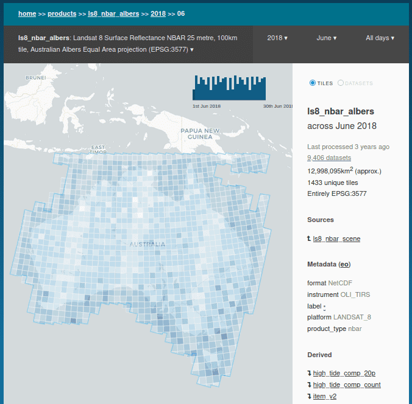

# Data Cube Explorer

## Usage (quick-start)

Assuming you already have an Open Data Cube instance, Explorer will use
its existing settings.

Install Explorer:

    pip install datacube-explorer

Generate summaries for all of your products:

    cubedash-gen --init --all

Run Explorer locally:

    cubedash-run

It will now be viewable on [http://localhost:8090](https://localhost:8090)

## Developer Setup

These directions are for running from a local folder in development. But it will run from any typical Python WSGI server.

Firstly, install the Open Data Cube. Use of a [Data Cube conda environment](https://datacube-core.readthedocs.io/en/latest/installation/setup/common_install.html)
is recommended. You may need to also `conda install -c conda-forge postgis`

Test that you can run `datacube system check`, and that it's connecting
to the correct datacube instance.

### Dependencies

Now install the explorer dependencies:

    # These two should come from conda if you're using it, not pypi
    conda install fiona shapely

    pip install -e .

### Summary generation

Initialise and create product summaries:

    cubedash-gen --init --all

(This can take a long time the first time, depending on your datacube size.)

Other available options can be seen by running `cubedash-gen --help`.

### Run

A `cubedash-run` command is available to run Explorer locally:

    $ cubedash-run
        * Running on http://localhost:8080/ (Press CTRL+C to quit)

(see `cubedash-run --help` for list of options)

But Explorer can be run using any typical Python WSGI server, for example [gunicorn](https://gunicorn.org/):

    pip install gunicorn
    gunicorn -b '127.0.0.1:8080' -w 4 cubedash:app

Products will begin appearing one-by-one as the summaries are generated in the
background.  If impatient, you can manually navigate to a product using
`/<product_name`. (Eg `/ls5_nbar_albers`)

### Code Style

All code is formatted using [black](https://github.com/ambv/black), and checked
with [pyflakes](https://github.com/PyCQA/pyflakes).

They are included when installing the test dependencies:

    pip install --upgrade --no-deps --extra-index-url https://packages.dea.ga.gov.au/ 'datacube' 'digitalearthau'

    pip install -e .[test]

Run `make lint` to check your changes, and `make format` to format your code
automatically.

You may want to configure your editor to run black automatically on file save
(see the Black page for directions), or install the pre-commit hook within Git:

### Pre-commit setup

A [pre-commit](https://pre-commit.com/) config is provided to automatically format
and check your code changes. This allows you to immediately catch and fix
issues before you raise a failing pull request (which run the same checks under
Travis).

Install pre-commit from pip, and initialise it in your repo:

    pip install pre-commit
    pre-commit install

Your code will now be formatted and validated before each commit. You can also
invoke it manually by running `pre-commit run`

**Note**: If you use Conda, install from conda-forge (This is *required* because the pip
version uses virtualenvs which are incompatible with Conda's environments)

    conda install pre_commit

## FAQ

### Can I use a different datacube environment?

Set ODC's environment variable before running the server:

    export DATACUBE_ENVIRONMENT=staging

You can always see which environment/settings will be used by running `datacube system check`.

See the ODC documentation for config and [datacube environments](https://datacube-core.readthedocs.io/en/latest/user/config.html#runtime-config)

### How can I set different timezone

Datacube-explorer default timezone is configured to: `Australia/Darwin`.

To configure the instance to a different timezone, the following configuration needs to be applied:

- `os.environment` variable `CUBEDASH_DEFAULT_TIMEZONE`
- `app.config` variable `CUBEDASH_DEFAULT_TIMEZONE`

### Can I add custom scripts or text to the page (such as analytics)?

Create one of the following `*.env.html` files:

- Global include: for `<script>` and other tags at the bottom of every page.

      cubedash/templates/include-global.env.html

- Footer text include. For human text such as Copyright statements.

      echo "Server <strong>staging-1.test</strong>" > cubedash/templates/include-footer.env.html

(`*.env.html` is the naming convention used for environment-specific templates: they are ignored by
Git)

### How can I configure the deployment?

refer to [deployment instructions](https://datacube-explorer.readthedocs.io/en/latest/deploying.html) and [app-config](https://datacube-explorer.readthedocs.io/en/latest/config.html)

### How do I modify the CSS/Javascript?

The CSS is compiled from [Sass](https://sass-lang.com/), and the Javascript is compiled from
[Typescript](https://www.typescriptlang.org/).

Install [npm](https://www.npmjs.com/get-npm), and then install them both:

    npm install -g sass typescript

You can now run `make static` to rebuild all the static files, or
individually with `make style` or `make js`.

Alternatively, if using [PyCharm](https://www.jetbrains.com/pycharm), open a
Sass file and you will be prompted to enable a `File Watcher` to
compile automatically.

PyCharm will also compile the Typescript automatically by ticking
the "Recompile on changes" option in `Languages & Frameworks ->
Typescript`.

### How do I run the integration tests?

The integration tests run against a real PostgreSQL database, which is
automatically started and stopped using Docker. This requires Docker to
be available, but no further database setup is required.

Install the test dependencies: `pip install -e .[test]`

The run the tests with: `pytest integration_tests`

### How do I add test data for the automated tests?

Most of the automated tests for Datacube Explorer require sample data to run. This comprises
definitions of ODC *Metadata Types*, *Products* and *Datasets*.

These are contained within YAML files in the [`integration_tests/data`](https://github.com/opendatacube/datacube-explorer/tree/develop/integration_tests/data) directory.

Test data is loaded using a pytest fixture called `auto_odc_db`, which is activated per
test module, and will automatically populate the database using files referenced in module
global variables. Activate and use it similar to the following example:

    pytestmark = pytest.mark.usefixtures("auto_odc_db")

    METADATA_TYPES = ["metadata/qga_eo.yaml"]
    PRODUCTS = ["products/ga_s2_ard.odc-product.yaml"]
    DATASETS = ["s2a_ard_granule.yaml.gz"]

To add sample datasets required for the test case, create a `.yaml` file
with the product name and place all the sample datasets split by `---` in the yaml.

If the sample datasets file is large, compress it with `gzip <dataset_file>.yaml` and reference
that file instead.

## Roles for production deployments

The [roles](cubedash/summary/roles) directory contains sql files for creating
Postgres roles for Explorer. These are suitable for running each Explorer
task with minimum needed security permissions.

Three roles are created:

- **explorer-viewer**: A read-only user of datacube and Explorer. Suitable for the web interface and cli (`cubedash-view`) commands.
- **explorer-generator**: Suitable for generating and updating summaries (ie. Running `cubedash-gen`)
- **explorer-owner**: For creating and updating the schema. (ie. Running `cubedash-gen --init`)

Note that these roles extend the built-in datacube role `agdc_user`. If you
created your datacube without permissions, a stand-alone creator of the `agdc_user`
role is available as a prerequisite in the same [roles](cubedash/summary/roles)
directory.

## Docker for Development and running tests

You need to have Docker and Docker Compose installed on your system.

To create your environment, run `make up` or `docker-compose up`.

You need an ODC database, so you'll need to refer to the [ODC docs](https://datacube-core.readthedocs.io/en/latest/) for help on indexing, but you can create the database by running `make initdb` or `docker-compose exec explorer datacube system init`. (This is not enough, you still need to add a product and index datasets.)

When you have some ODC data indexed, you can run `make index` to create the Explorer indexes.

Once Explorer indexes have been created, you can browse the running application at [http://localhost:5000](http://localhost:5000).

You can run tests by first creating a test database `make create-test-db-docker` and then running tests with `make test-docker`.

And you can run a single test in Docker using a command like this: `docker-compose --file docker-compose.yml run explorer pytest integration_tests/test_dataset_listing.py`

## Docker-compose for Development and running tests
### Testing with app.config
edit `.docker/settings_docker.py` and setup application config. Then `docker-compose -f docker-compose.yml -f docker-compose.override.yml up` to bring up explorer docker with database, explorer with settings

## STAC API Extensions

The STAC endpoint implements the [query](https://github.com/stac-api-extensions/query), [filter](https://github.com/stac-api-extensions/filter), [fields](https://github.com/stac-api-extensions/fields), and [sort](https://github.com/stac-api-extensions/sort) extensions, all of which are bound to the `search` endpoint as used with POST requests, with fields and sort additionally bound to the features endpoint.

Fields contained in the item properties must be prefixed with `properties.`, ex `properties.dea:dataset_maturity`.

The implementation of `fields` differs somewhat from the suggested include/exclude semantics in that it does not permit for invalid STAC entities, so the `id`, `type`, `geometry`, `bbox`, `links`, `assets`, `properties.datetime`, and `stac_version` fields will always be included, regardless of user input.

The implementation of `filter` is limited, and currently only supports CQL2 JSON syntax with the following basic CQL2 operators: `AND`, `OR`, `=`, `>`, `>=`, `<`, `<=`, `<>`, `IS NULL`.
