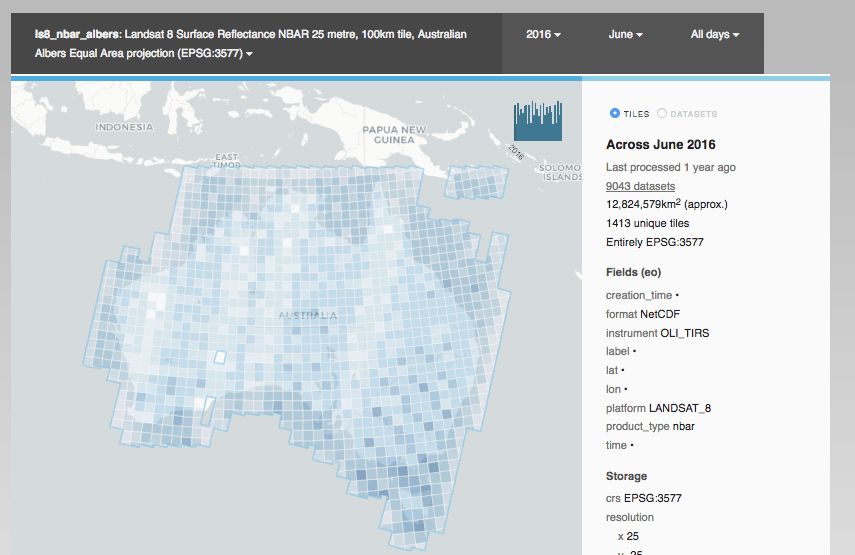

# Data Cube Explorer  

## Developer Setup

These directions are for running from a local folder in development. But it will run from any typical Python WSGI server. 

Firstly, install Data Cube. Use of a [Data Cube conda environment](https://datacube-core.readthedocs.io/en/latest/ops/conda.html)
is recommended.

Test that you can run `datacube system check`, and that it's connecting
to the correct instance. 

### Dependencies

Now install the explorer dependencies:

    # These two should come from conda if you're using it, not pypi
    conda install fiona shapely
    
    pip install -e .

### Summary generation

Cache some product summaries:

    nohup cubedash-gen --all &>> summary-gen.log &

(This can take a while the first time, depending on your datacube size. 
We're using `nohup .. &` to run in the background.)

### Run

Run using any typical python wsgi server, for example:

    pip install gunicorn
    gunicorn -b '127.0.0.1:8080' -w 4 cubedash:app

Convenience scripts are available for running in development with hot-reload (`./run-dev.sh`)
or gunicorn (`./run.sh`). Install the optional deployment dependencies for the latter: `pip install -e .[deployment]`

Products will begin appearing one-by-one as the summaries are generated in the background.
If impatient, you can manually navigate to a product using `/<product_name`. (Eg `/ls5_nbar_albers`) 

## FAQ

### Can I use a different datacube environment?

Set ODC's environment variable before running the server:

    export DATACUBE_ENVIRONMENT=staging

You can always see which environment/settings will be used by running `datacube system check`.

See the ODC documentation for config and [datacube environments](https://datacube-core.readthedocs.io/en/latest/user/config.html#runtime-config) 

### Can I add custom scripts or text to the page (such as analytics)?

Create one of the following `*.env.html` files:

- Global include: for `<script>` and other tags at the bottom of every page.

      cubedash/templates/include-global.env.html

- Footer text include. For human text such as Copyright statements.
  
      echo "Server <strong>staging-1.test</strong>" > cubedash/templates/include-footer.env.html

(`*.env.html` is the naming convention used for environment-specific templates: they are ignored by 
Git)

### How can I configure the deployment?

Add a file to the current directory called `settings.env.py`

You can alter default [Flask](http://flask.pocoo.org/docs/1.0/config/) or
[Flask Cache](https://pythonhosted.org/Flask-Caching/#configuring-flask-caching) settings 
(default "CACHE_TYPE: simple"), as well as some cubedash-specific settings:

    # Default product to display (picks first available)
    CUBEDASH_DEFAULT_PRODUCTS = ('ls8_nbar_albers', 'ls7_nbar_albers')
    
    # Which field should we use when grouping products in the top menu?
    CUBEDASH_PRODUCT_GROUP_BY_FIELD = 'product_type'
    # Ungrouped products will be grouped together in this size.
    CUBEDASH_PRODUCT_GROUP_SIZE = 5
    
    # Maximum search results
    CUBEDASH_HARD_SEARCH_LIMIT = 100
    # Maximum number of source/derived datasets to show
    CUBEDASH_PROVENANCE_DISPLAY_LIMIT = 20
    
    # Include load performance metrics in http response.
    CUBEDASH_SHOW_PERF_TIMES = False
    
    # Which theme to use (in the cubedash/themes folder)
    CUBEDASH_THEME = 'odc'

[Sentry](https://sentry.io/) error reporting is supported by adding a `SENTRY_CONFIG` section.
See [their documentation](https://docs.sentry.io/clients/python/integrations/flask/#settings).  

### Why aren't stylesheets updating?

The CSS is compiled from [Sass](https://sass-lang.com/). Run `make` to rebuild them after a change,
or use your editor to watch for changes (PyCharm will prompt to do so).

### How do I run the integration tests?
    
The integration tests run against a real postgres database, which is dropped and 
recreated between each test method:

Install the test dependencies: `pip install -e .[test]`

#### Simple test setup

Set up a database on localhost that doesn't prompt for a password locally (eg. add credentials to `~/.pgpass`)

Then: `createdb dea_integration`

And the tests should be runnable with no configuration: `pytest integration_tests`

#### Custom test configuration (using other hosts, postgres servers)

Add a `.datacube_integration.conf` file to your home directory in the same format as 
[datacube config files](https://datacube-core.readthedocs.io/en/latest/user/config.html#runtime-config).

(You might already have one if you run datacube's integration tests)

Then run pytest: `pytest integration_tests`

__Warning__ All data in this database will be dropped while running tests. Use a separate one from your normal 
development db.
