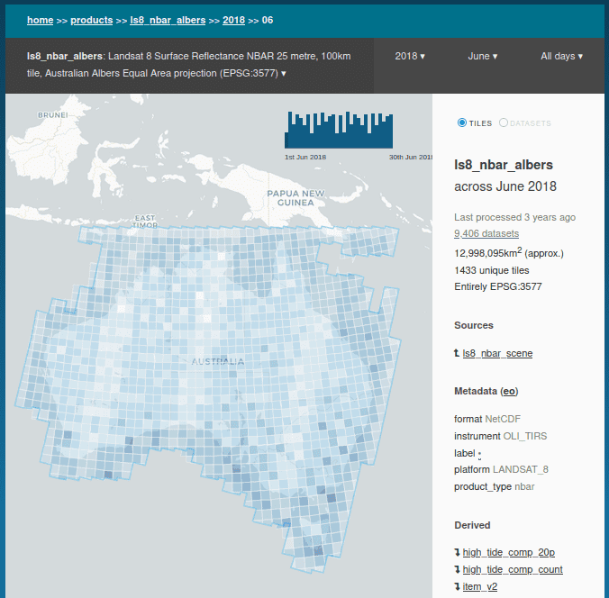

Dataube Explorer
================

Dataube Explorer is part of the Open Data Cube ecosystem of software for geospatial data management and access.
It is what you need to answer "What's in my datacube?".

It is a web application for exploring which products and data are available,
and visualising what is available through time and space.

It also includes a STAC API for HTTP based programmatic access to an Open Data Cube
database, rather than the PostgreSQL access required by the Core ODC library.

Operations Guide
----------------

.. toctree::
   :maxdepth: 2

   operating

Development Guide
-----------------

.. toctree::
   :maxdepth: 2

   development
